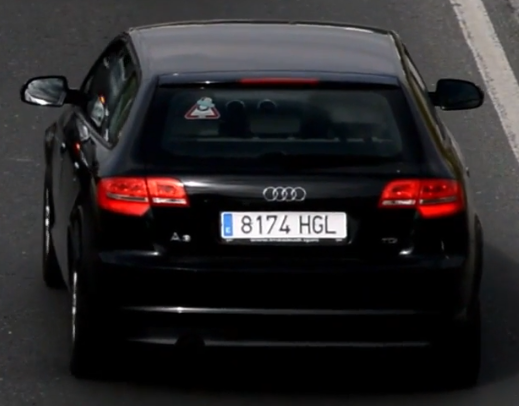
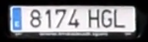

# Real-Time Wrong Side Vehicle License Plate Detection

This project demonstrates real-time vehicle and license plate detection using YOLO (You Only Look Once) and OpenCV. It processes videos to detect vehicles and license plates, extract bounding boxes and OCR (optical character recognition) for license plate text extraction. The output video is saved to disk, and live detection results are displayed in a resized OpenCV window.


- Input Vehicle Image



- Extracted Vehicle License Plate Number


## Project Overview

The system performs the following tasks in real-time:
- Vehicle detection and tracking using YOLOv10
- License plate detection using a custom-trained YOLO model
- Optical Character Recognition (OCR) using EasyOCR
- Vehicle direction analysis using road line detection
- Performance metrics tracking and visualization
- CSV output generation with detailed detection results

### Key Components:
- **Vehicle Detection**: Uses YOLOv10 for accurate vehicle classification
- **License Plate Detection**: Custom YOLO model trained for license plate recognition
- **OCR Processing**: EasyOCR implementation for text extraction from plates
- **Direction Analysis**: Tracks vehicle movement relative to detected road lines
- **Performance Optimization**: Configurable FPS reduction and window resizing

---

## Features

### Detection and Recognition
- **YOLO-Based Detection**: Detects vehicles and license plates in uploaded or live videos
- **Multi-Model Architecture**: 
  - Vehicle Detection: YOLOv10 model trained for vehicle classification
  - License Plate Detection: Custom YOLO model optimized for plate recognition
- **Comprehensive Tracking**: Vehicle tracking with unique IDs for consistent detection
- **Direction Analysis**: Intelligent road line detection for vehicle movement tracking

### Processing and Performance
- **Real-Time Processing**: Live output display with configurable window size
- **Performance Optimization**:
  - Customizable FPS reduction for resource management
  - Batch processing capabilities
  - Configurable confidence thresholds
- **Preprocessing Pipeline**: Image enhancement for improved OCR accuracy
  
### Output and Analytics
- **License Plate OCR**: EasyOCR integration for accurate text extraction
- **Multi-format Output**:
  - Processed video with annotations
  - CSV reports with detection details
  - Performance metrics and visualizations
- **Detailed Logging**: Comprehensive logging of detection events and system performance

### Web Interface
- **FastAPI Backend**: RESTful API for video processing
- **User-Friendly Frontend**: Simple web interface for video upload and processing
- **Real-Time Status**: Processing status updates and progress tracking
- **Results Visualization**: Interactive display of detection results

---

## Technical Details

### Model Architecture
- **Vehicle Detection**: 
  - YOLOv10 model with optimized backbone
  - Confidence threshold: 0.6
  - Image size: 640x640
  - Track persistence enabled for consistent detection

- **License Plate Detection**:
  - Custom-trained YOLO model
  - Specialized for license plate detection
  - High-precision detection with custom preprocessing

- **OCR System**:
  - EasyOCR implementation
  - Pre-processing pipeline for enhanced text extraction
  - Support for multiple plate formats

### Performance Optimization
- **Frame Processing**:
  - Configurable FPS reduction
  - Batch processing support
  - Automatic window resizing
  - Real-time performance monitoring

- **Direction Analysis**:
  - Dynamic road line detection
  - Movement tracking algorithm
  - Direction classification system

### Output Generation
- **Video Processing**:
  - Annotated frames with detected objects
  - Bounding box visualization
  - Real-time OCR results display

- **Data Analytics**:
  - CSV generation with detection details
  - Performance metrics logging
  - Statistical analysis capabilities

## Prerequisites

Before running the application, ensure the following:

1. **Python Version**: Python 3.12 or higher
2. **Dependencies**:
   - Create a virtual environment:
     ```bash
     conda create -n YOLO python=3.12
     ```
   - Activate the virtual environment:
     ```bash
     conda activate YOLO
     ```
   - Install required packages:
     ```bash
     pip install -r requirements.txt
     ```
   - Core dependencies:
     - `ultralytics`: YOLOv10 implementation
     - `opencv-python`: Image processing
     - `easyocr`: License plate text extraction
     - `FastAPI`: Web API framework
     - `numpy`: Numerical operations
     - `pandas`: Data handling

---

## Installation

1. **Clone the Repository**:

   ```bash
   git clone https://github.com/FaisalAhmedBijoy/automatic-license-plate-detection
   ```

2. **Run Vehicle Detection Without GUI**:

   ```bash
      python -m app.license_plate_detection
   ```

   Output video will be saved in the `app/outputs` folder and csv be saved in the `app/outputs` folder.


- Output Video

   [](app/outputs/outputs_video/output_video_2.mp4)

   Or download and watch it:  
      [Download Video](app/outputs/outputs_video/output_video_2.mp4)

---

- Output CSV

   [Download CSV](app/outputs/csv_files/vehicle_detection_results_video_2.csv)

   Here’s a preview:

   | Frame | Type | Status | Confidence | Plate       |
   |:-----:|:----:|:------:|:----------:|:-----------:|
   | 10    | car  | Wrong  | 0.614806   | 0 3693 FSG  |
   | 11    | car  | Wrong  | 0.884313   | 1357 4 BNW  |
   | 10    | car  | Wrong  | 0.719564   | 3693 FSG    |


3. **Run Vehicle Detection With GUI**:

   Run the following command to start the FastAPI server and access the web interface:

   ```bash
      python -m app.main
   ```

   Open your web browser and navigate to `http://localhost:8000` to access the application.

   Check the API documentation at `http://localhost:8000/docs` for more details on the available endpoints.

   

   Another approach is open the `webpage.html` file in your browser to access the web interface.
   The web interface allows you to upload a video file

   The processed video will be saved in the `app/results` folder and the csv file will be saved in the `app/results` folder.

   Server Response:

   ```json
   {
     "message": "Processing complete",
     "output_video": "app/results/processed_a15ef89a-8907-4089-9ec5-d9643946e45e.mp4",
     "results_csv": "app/results/output_2569bc76-ee74-4d5f-9681-51ab09f58ea9.csv"
   }
   ```
